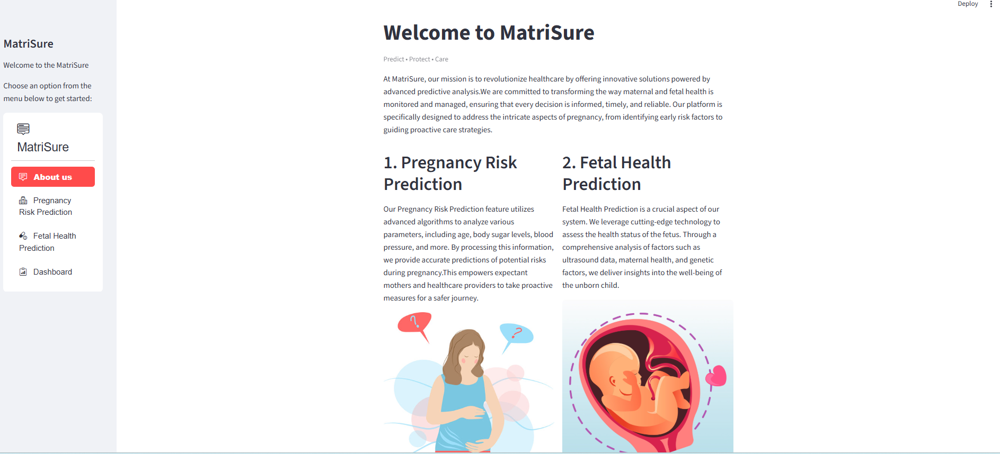
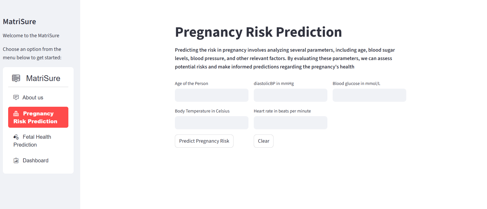
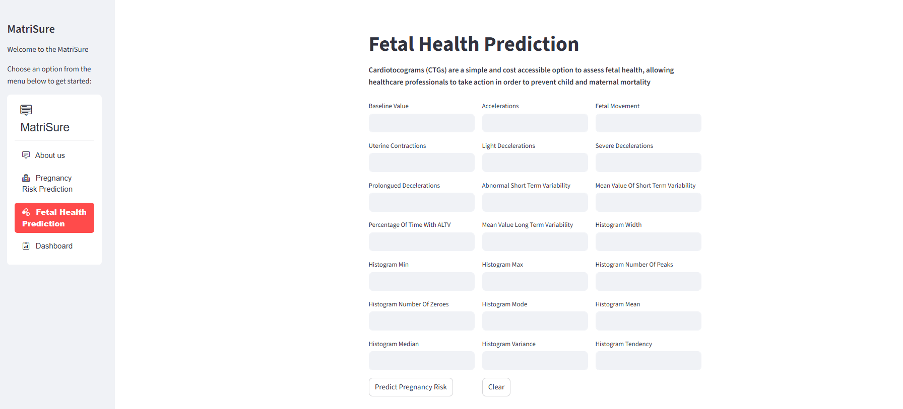
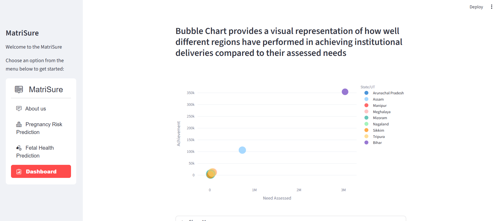

# MatriSure – Predict. Protect. Care.

## Introduction

Welcome to MatriSure, an innovative platform dedicated to advancing maternal and fetal health through AI-powered predictive analysis. MatriSure empowers healthcare professionals and expectant mothers by providing accurate risk predictions and proactive health management during pregnancy.

## Key Features

- **Pregnancy Risk Prediction:** Utilizes advanced machine learning algorithms to analyze parameters such as age, blood sugar levels, blood pressure, and more. Provides early detection of potential risks to support safer pregnancies.

- **Fetal Health Prediction:** Incorporates Cardiotocograms (CTGs), a simple and cost-effective method to assess fetal health, enabling timely medical interventions to reduce maternal and child mortality.

- **Dashboard:** A user-friendly interface offering a holistic view of predictive analyses. Designed for accessibility and ease of use, it empowers both healthcare professionals and mothers with clear, actionable insights.

<p align="center">
     

</p>

<p align="center">
     

</p>

## How to Run the Streamlit Code

Follow these steps to run the Streamlit code locally:

### Clone the Repository

```bash
git clone https://github.com/your-username/matrisure.git
cd matrisure
```
### Install Dependencies
 ```bash
 pip install -r requirements.txt
 ```
 ### Run the Streamlit App
 ```bash
streamlit run main.py
```
This will launch the Streamlit app locally. Open your web browser and navigate to the provided local address to explore MatriSure.# Maternal_Health_Prediction

